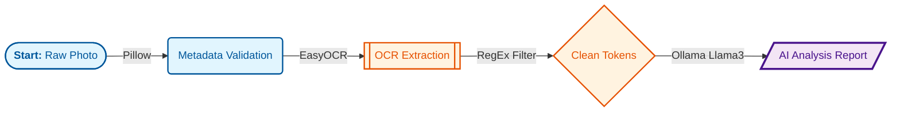
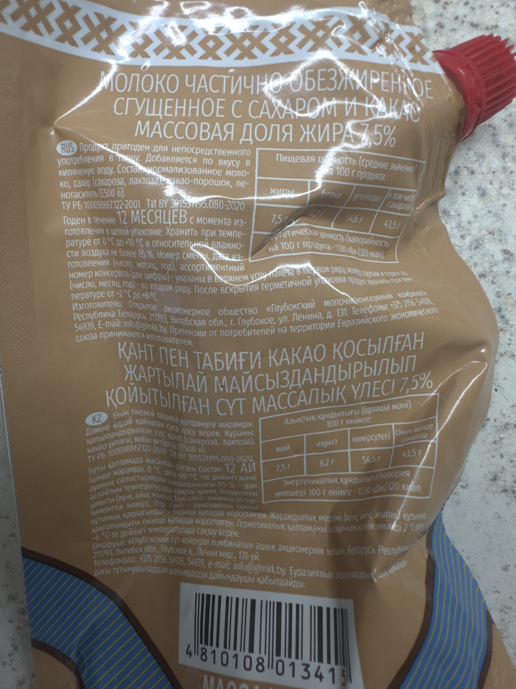

# AI Nutri-Lens: Multimodal Ingredient Analyzer 🍏🔬

**AI Nutri-Lens** is an end-to-end Computer Vision & NLP pipeline designed to translate complex chemical food labels into clear, actionable health insights. By leveraging local LLM inference, it ensures data privacy while providing expert-level nutritional analysis.

## 🌟 Key Features
* **OCR Engine:** High-resolution text extraction using **EasyOCR** (PyTorch-based).
* **Local AI Inference:** Deep ingredient analysis using **Ollama (Llama 3)**, eliminating the need for cloud APIs.
* **Context-Aware Processing:** Specialized prompts for CIS & Global markets (definition of regional products,example with condensed milk in my project).
* **Robust Preprocessing:** Custom RegEx-based cleaning pipeline to handle OCR noise and distortions.

## 🛠 Tech Stack
* **CV:** EasyOCR, OpenCV, Pillow (PIL).
* **NLP & LLM:** Ollama, LangChain (conceptual), RegEx.
* **Core:** Python 3.11, PyTorch (with MPS acceleration for macOS).
* **DevOps:** Git, Virtualenv.

## 📈 Data Pipeline (Architecture)
1. **Data Ingestion:** Validation of raw JPG/PNG samples.
2. **OCR Stage:** Converting visual pixel data into unstructured raw text.
3. **Text Cleaning:** Tokenization and filtering of non-alphanumeric OCR artifacts.
4. **LLM Analysis:** Semantic interpretation of ingredients and safety rating.

## 🛠 Installation & Usage
1. Install Ollama and pull Llama3: `ollama run llama3`
2. Clone repo: `git clone https://github.com`
3. Install dependencies: `pip install -r requirements.txt`
4. Run: `python src/main.py`

## 🛡 Challenges Overcome
* **SSL/Certificates:** Resolved macOS Python cert issues for model downloading.
* **Git Overhead:** Optimized repository by migrating from heavy DNG (ProRAW) to compressed JPG assets.
* **Context Gaps:** Improved AI accuracy for regional products through advanced Prompt Engineering.

## 📸 Real Case: From Pixels to Insights

| **Input Image** | **Extracted Raw Text** | **AI Health Verdict** |
| :--- | :--- | :--- |
|  | `CaXap, MoLoKo, E220...` | **8/10.** Traditional CIS product. High sugar content, but clean dairy fat profile. |

## 🗺 Future Roadmap
- [ ] **Mobile Integration:** Develop a lightweight Flutter UI for instant scanning.
- [ ] **RAG Implementation:** Connect a vector database of EU/CIS food regulations.
- [ ] **Barcode Support:** Fallback to barcode API if the label is too damaged.

## 🤝 Contributing
Feel free to fork this project, report issues, or suggest new Regex filters for specific chemical additives!